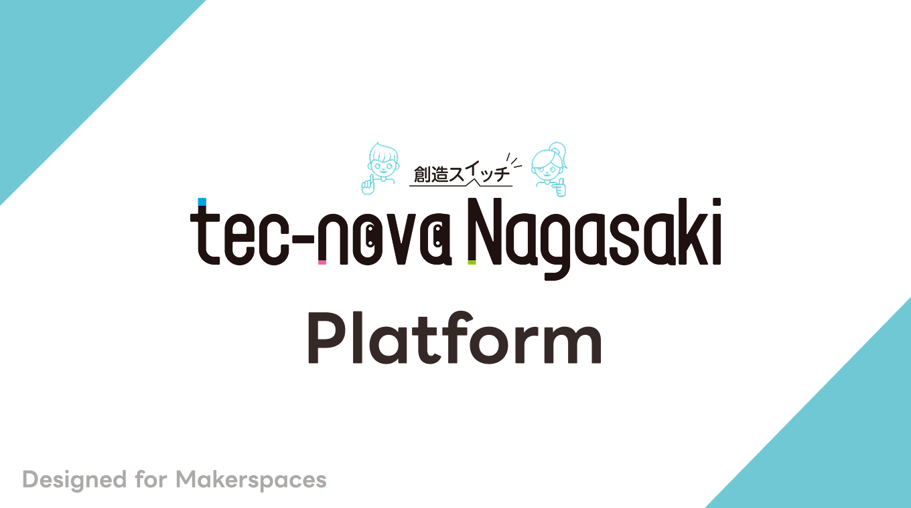
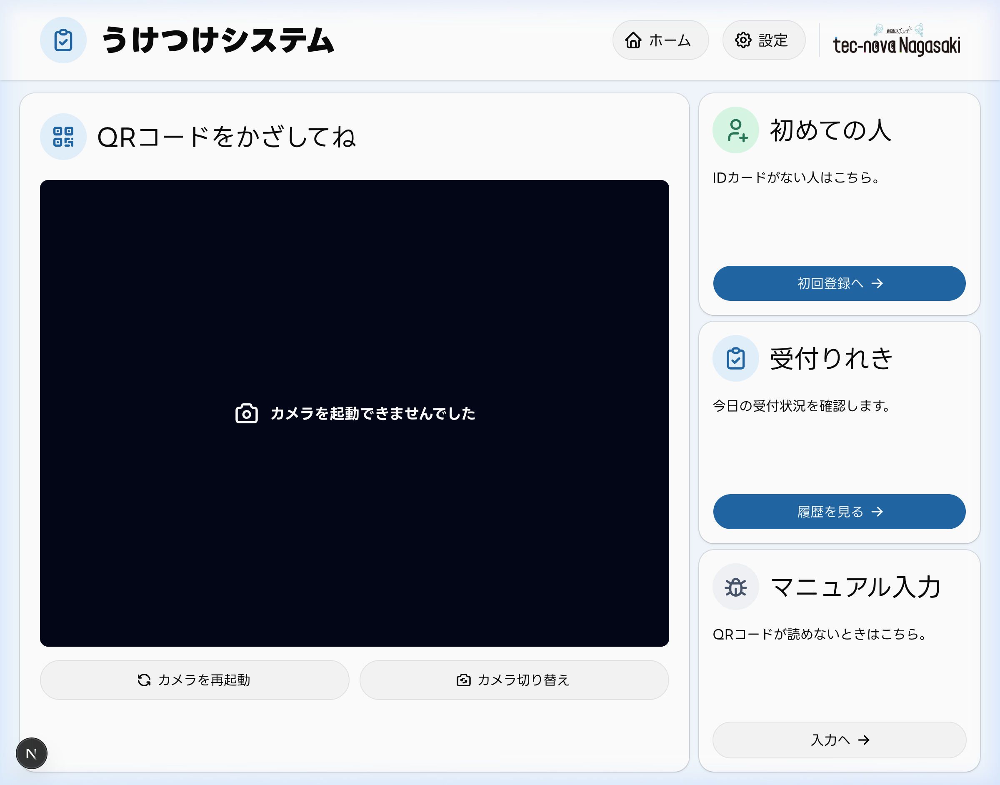
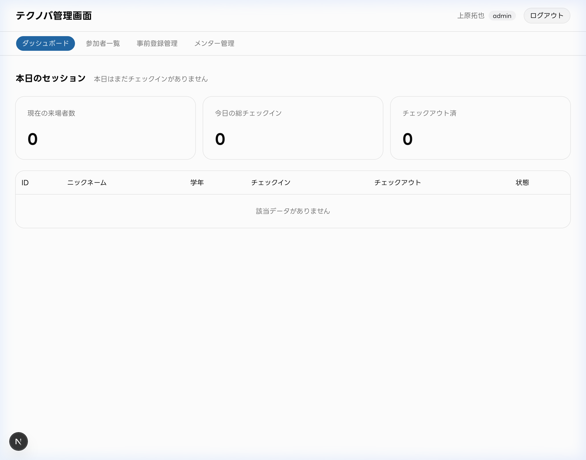
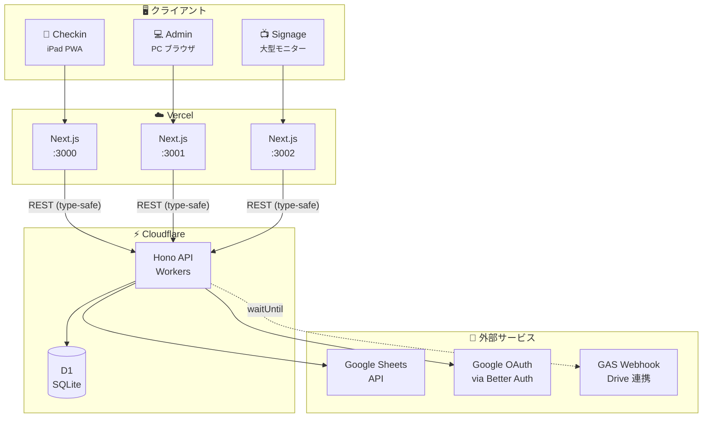
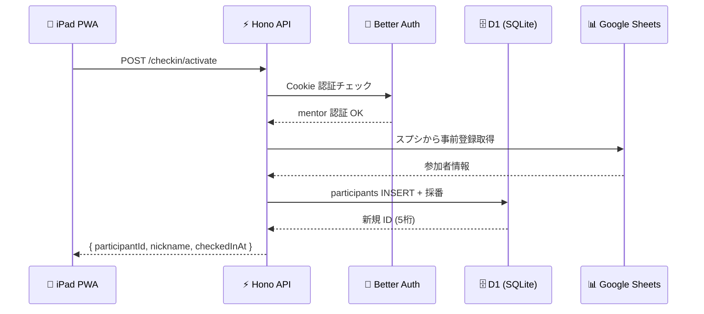
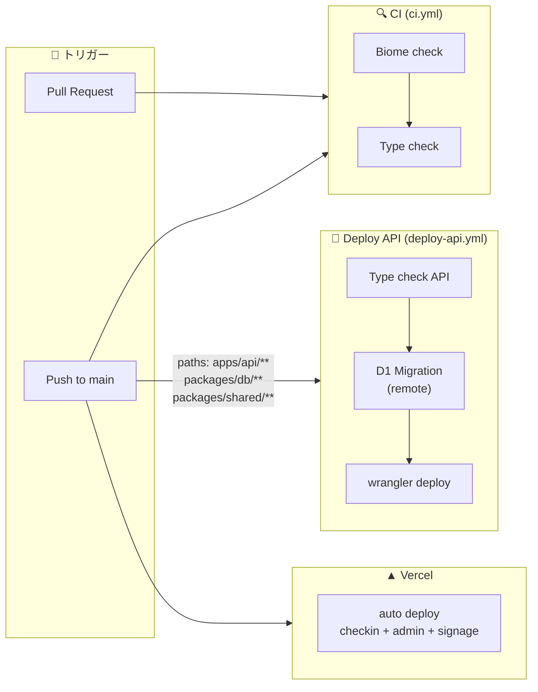

<p align="center">
  
</p>

<p align="center">
  <a href="https://github.com/ut42tech/tecnova-platform/actions/workflows/ci.yml">
    
  </a>
  <a href="https://github.com/ut42tech/tecnova-platform/actions/workflows/deploy-api.yml">
    
  </a>
  <a href="./LICENSE">
    
  </a>
  
  
  
</p>

---

## 📖 概要

`tecnova-platform` は、**メイカースペース向けに設計したモダンな Web プラットフォーム**です。子どもたちが自由に創作・ものづくりに取り組む施設の運営を、**受付（チェックイン / アウト）・参加者管理・研究データ収集** まで一気通貫で支えます。

最初の導入先は **tec-nova Nagasaki**（長崎市と長崎大学による共同事業）。小学 1 年〜高校 3 年の子どもが 3D プリンタ・プログラミング・ロボット・3D モデリングなどに自由来場で取り組むファブリケーション活動です。

- 🎯 **解決する課題** — 紙とスプレッドシートに依存していた受付・名簿照合・二重登録の混乱を、構造的に解消する
- 🧩 **システム構成** — 1 つの API（Hono on Cloudflare Workers）＋ クライアント（iPad 受付 / 管理 PC / 会場サイネージ）を同一バックエンドから提供する API-first 設計
- 🔐 **プライバシー設計** — 住所・連絡先などの機微情報は内製 DB に持たず運営側の管理下に限定。保持するのは氏名・ニックネーム・学年のみ

### 受付のしくみ

1. 子どもがネームカードの **QR / バーコード** を iPad にかざす
2. API が参加者 DB（Cloudflare D1）を照合し、**チェックイン / チェックアウトを自動判定**
3. 初回来場者は事前登録情報からその場で **アクティベート（内製 ID 採番）**
4. 管理 PC のダッシュボードで **当日の来場状況をリアルタイムに把握**

---

## 📸 Screenshots

|      iPad チェックインアプリ（`apps/checkin`）       |           管理ダッシュボード（`apps/admin`）           |
| :--------------------------------------------------: | :----------------------------------------------------: |
|  |  |

---

## ✨ 主な機能

| 機能                             | 説明                                                    |
| -------------------------------- | ------------------------------------------------------- |
| 📱 iPad PWA チェックイン         | QR / バーコードでワンタップ入退場                       |
| 🆕 「初めての方」フロー          | 事前登録情報から本人選択 → 自動採番 → アクティベート    |
| 🗂️ 事前登録管理                  | 学生側スプシの未アクティベート行を admin から追加・削除 |
| 🔗 Google Sheets 連携            | 教員側のプライバシー要件に配慮した双方向分離設計        |
| 🔐 Google OAuth + 許可リスト     | 運営者のみがアクセスできるシンプルな認証                |
| 📊 管理ダッシュボード            | 当日の来場状況をリアルタイム把握                        |
| 🔍 名前検索 & 手入力             | QR が読めない場合のフォールバック                       |
| 📋 受付履歴 & 一括チェックアウト | 当日の全操作ログとワンタップ一括退場                    |
| 📂 Drive 自動連携                | アクティベート時に GAS 経由で Drive フォルダ自動生成    |
| 📺 会場サイネージ                | 大型モニター向け配信風表示。動画再生・チャイム・来場/にぎわい情報を巡回 |

> 今後のロードマップ・フェーズ計画は [`docs/requirements.md`](./docs/requirements.md)（スコープとフェーズ計画）と [`docs/handoff.md`](./docs/handoff.md)（進捗・残タスク）を参照してください。

---

## 🛠️ Tech Stack

### Backend

| Technology                                                                                                    | Purpose                              |
| ------------------------------------------------------------------------------------------------------------- | ------------------------------------ |
|                                  | Ultrafast web framework for the edge |
|  | Edge runtime                         |
| -F38020?logo=cloudflare&logoColor=white>)           | Workers-native database              |
|                  | TypeScript-first ORM                 |
|                               | Framework-agnostic authentication    |

### Frontend

| Technology                                                                                           | Purpose                      |
| ---------------------------------------------------------------------------------------------------- | ---------------------------- |
|                                  | React framework (App Router) |
|                     | UI library                   |
|              | Component library            |
|  | Utility-first CSS            |
|                        | Hosting & deployment         |

### Tooling

| Technology                                                                                   | Purpose                  |
| -------------------------------------------------------------------------------------------- | ------------------------ |
|                | Monorepo package manager |
|  | Build orchestration      |
|            | Lint & format            |

---

## 🏗️ Architecture

### システム全体図



### リクエスト処理フロー



---

## 📁 Repository Structure

```
tecnova-platform/
├── .github/workflows/
│   ├── ci.yml                     # Biome check + Type check (PR / main push)
│   └── deploy-api.yml             # D1 migration + Workers deploy (main push)
├── apps/
│   ├── api/                       # Hono on Cloudflare Workers
│   │   └── src/
│   │       ├── index.ts           # エントリポイント + CORS/Auth middleware
│   │       ├── routes/            # checkin/* / api/* ルート群
│   │       ├── middleware/        # requireAuthenticatedMentor 等
│   │       ├── lib/               # auth factory, checkin ロジック
│   │       └── types.ts           # Env bindings 型定義
│   ├── checkin/                   # Next.js 16 — iPad PWA
│   │   └── src/
│   │       ├── app/               # App Router pages (/, /login, /first-time, etc.)
│   │       ├── components/        # QRスキャナ, 受付カード, 履歴テーブル
│   │       └── lib/               # api-client, auth-client
│   ├── admin/                     # Next.js 16 — 管理画面 (PC)
│   │   └── src/
│   │       ├── app/               # ダッシュボード, 参加者一覧, メンター管理
│   │       ├── components/        # データテーブル, フォーム
│   │       └── lib/               # api-client, auth-client
│   └── signage/                   # Next.js 16 — 会場サイネージ (大型モニター・キオスク)
│       └── src/
│           ├── app/               # 配信風サイネージ画面
│           ├── components/        # 動画ステージ, チャイムレール, インフォティッカー
│           ├── config/            # フォールバック動画プレイリスト
│           └── lib/               # api-client, auth-client, now (時刻ソース)
├── packages/
│   ├── db/                        # Drizzle schema + D1 migrations
│   ├── shared/                    # 共通型・Zod スキーマ・Sheets 連携
│   └── ui/                        # 共通 UI (api-client / MeProvider / JST utils)
├── docs/
│   ├── requirements.md            # 全体要件定義書
│   ├── mvp.md                     # MVP 実装仕様リファレンス
│   ├── architecture.md            # 全体システム構成図・拡張ロードマップ
│   └── handoff.md                 # セッション引き継ぎノート
├── biome.json
├── turbo.json
├── pnpm-workspace.yaml
└── tsconfig.base.json
```

---

## 📚 Documentation

| ドキュメント                                        | 内容                                                                                                                                                                    |
| --------------------------------------------------- | ----------------------------------------------------------------------------------------------------------------------------------------------------------------------- |
| 📘 [`docs/requirements.md`](./docs/requirements.md) | プロジェクトの背景・目的、ステークホルダー、データモデル、API 設計方針、非機能要件、リスク管理、設計判断の根拠を網羅した全体要件定義書                                  |
| 📗 [`docs/mvp.md`](./docs/mvp.md)                   | MVP（Phase 1）の実装仕様リファレンス。Drizzle スキーマ、API 仕様、画面仕様、Google Sheets API 連携の詳細実装、セットアップ手順、トラブルシュートを含む                 |
| 📐 [`docs/architecture.md`](./docs/architecture.md) | 全体システム構成図と拡張ロードマップ。現行コンポーネントの責務分担と Phase 1.5 以降の拡張計画を俯瞰する                                                                 |
| 📙 [`docs/handoff.md`](./docs/handoff.md)           | 開発引き継ぎノート。進捗ステータス・既知の罠と回避策・残タスクをまとめた実装者向けドキュメント                                                                          |

---

## 🚀 Getting Started

### Prerequisites

| ツール                | バージョン         |
| --------------------- | ------------------ |
| Node.js               | ≥ 22               |
| pnpm                  | ≥ 10               |
| Cloudflare アカウント | Workers + D1       |
| Vercel アカウント     | —                  |
| GCP                   | Sheets API + OAuth |

### Setup

```bash
# Clone
git clone https://github.com/ut42tech/tecnova-platform.git
cd tecnova-platform

# Install dependencies
pnpm install

# Copy env example
cp .env.example .env.local
# .env.local に必要な値を設定（apps/api は別途 .dev.vars が必要）

# Generate D1 migrations
pnpm --filter @tecnova/db db:generate

# Apply migrations to local D1 (Miniflare)
pnpm --filter @tecnova/api db:apply:local

# Start all dev servers
pnpm dev
```

> [!TIP]
> `pnpm dev` は Turborepo 経由で `api` (`:8787`)・`checkin` (`:3000`)・`admin` (`:3001`)・`signage` (`:3002`) を同時起動します。

詳細なセットアップ手順は [`docs/mvp.md`](./docs/mvp.md#8-セットアップ手順) を参照してください。

---

## 🚢 Deployment & CI/CD

### パイプライン概要



### デプロイ先

| アプリ         | プラットフォーム   | トリガー                                    |
| -------------- | ------------------ | ------------------------------------------- |
| `apps/api`     | Cloudflare Workers | GitHub Actions — `main` push (paths filter) |
| `apps/checkin` | Vercel             | GitHub 連携 — 自動デプロイ                  |
| `apps/admin`   | Vercel             | GitHub 連携 — 自動デプロイ                  |
| `apps/signage` | Vercel             | GitHub 連携 — 自動デプロイ                  |

### Required GitHub Secrets

| 名前                    | 用途                                                        |
| ----------------------- | ----------------------------------------------------------- |
| `CLOUDFLARE_API_TOKEN`  | Workers / D1 への deploy・migration 権限を持つ API トークン |
| `CLOUDFLARE_ACCOUNT_ID` | Cloudflare Account ID                                       |

> [!NOTE]
> Worker の Secrets（`GOOGLE_SERVICE_ACCOUNT_KEY` 等）は CI ではなく `wrangler secret put` で別途登録します。

---

## 🤝 Contributing

このプロジェクトはテクノバながさき固有の運用要件に基づいて設計されていますが、類似の教育・ファブリケーション活動の運営基盤として参考にしていただけます。

Issue・Discussion での質問は歓迎します。

---

## 📄 License

[MIT](./LICENSE)
