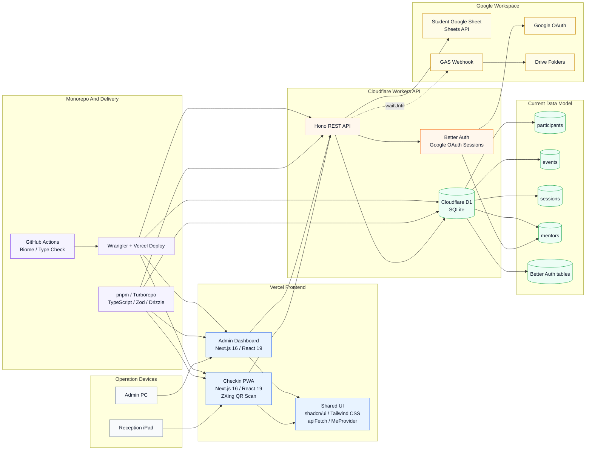

# Tecnova Platform Architecture

This document captures the current Tecnova Nagasaki operations platform and its
planned expansion scope.

The first diagram is a compact current-state overview. The detailed map below it
keeps the broader current and planned scope in one Mermaid `architecture-beta`
diagram. Mermaid brand logos require renderer-level icon-pack registration, so
the portable diagrams use text labels and the brand logos are shown as badges.

## Current Implementation Overview

  
  
  
  
  
  
  
  
  
  

## Detailed Architecture Map

```mermaid
architecture-beta
  group people(internet)[People And Devices]
  service child_kiosk(server)[Child And Reception iPad] in people
  service mentor_phone(server)[Mentor Smartphone Future] in people
  service admin_pc(server)[Admin PC Browser] in people
  service researcher_pc(server)[Researcher Analysis PC Future] in people
  service parent_browser(server)[Parent Browser Future] in people

  group frontend(cloud)[Vercel Frontend Apps]
  service checkin_app(server)[apps checkin Next PWA Current] in frontend
  service admin_app(server)[apps admin Next Web Current] in frontend
  service mentor_app(server)[apps mentor Next PWA Future] in frontend
  service analytics_app(server)[Analytics Dashboard Future] in frontend
  service parent_app(server)[Parent View Future] in frontend

  group edge(cloud)[Cloudflare Edge Platform]
  service worker(server)[apps api Hono Workers Current] in edge
  service d1(database)[Cloudflare D1 SQLite Current] in edge
  service r2(disk)[Cloudflare R2 Future] in edge
  service public_api(server)[Public API Future] in edge
  service api_keys(server)[API Key Auth Future] in edge

  group auth(cloud)[Authentication Boundary]
  service better_auth(server)[Better Auth Current] in auth
  service google_oauth(internet)[Google OAuth Current] in auth
  service mentor_allowlist(database)[Mentors Allowlist Current] in auth
  service session_cookie(disk)[Session Cookies Current] in auth

  group google(internet)[Google Workspace Services]
  service student_sheet(disk)[Student Sheet Current] in google
  service teacher_sheet(disk)[Teacher Sheet Future Sync] in google
  service sheets_api(server)[Google Sheets API Current] in google
  service gas_drive(server)[GAS Drive Webhook Current] in google
  service drive_folder(disk)[Participant Drive Folders Current] in google
  service form_feed(server)[Google Form Feed External] in google

  group core(server)[Current Backend Domain]
  service participants(database)[Participants Current] in core
  service events(database)[Events Current] in core
  service sessions(database)[Sessions Current] in core
  service mentors(database)[Mentors Current] in core
  service auth_tables(database)[Better Auth Tables Current] in core

  group planned(server)[Planned Domain Model]
  service activity_logs(database)[Activity Logs Future] in planned
  service activity_categories(database)[Activity Categories Future] in planned
  service equipment(database)[Equipment Master Future] in planned
  service collaborators(database)[Collaborators Future] in planned
  service reflection_ocr(server)[Vision LLM OCR Future] in planned
  service csv_export(disk)[CSV Export Future] in planned
  service offline_sync(server)[Offline Sync Future] in planned
  service crowd_status(server)[Crowd Status Future] in planned

  group packages(disk)[Monorepo Shared Packages]
  service ui_pkg(disk)[packages ui Current] in packages
  service shared_pkg(disk)[packages shared Current] in packages
  service db_pkg(disk)[packages db Current] in packages
  service schemas_pkg(disk)[Zod Schemas Current] in packages
  service sheets_client(disk)[Sheets Client Current] in packages
  service migrations(disk)[Drizzle Migrations Current] in packages

  group delivery(cloud)[Delivery And Operations]
  service github(server)[GitHub Repository Current] in delivery
  service actions(server)[GitHub Actions Current] in delivery
  service ci(server)[Biome And Type Check Current] in delivery
  service deploy_api(server)[Wrangler Deploy Current] in delivery
  service vercel_deploy(server)[Vercel Deploy Current] in delivery
  service secrets(disk)[Wrangler And Vercel Secrets Current] in delivery
  service ops_manual(disk)[Runbook And Rehearsal Current] in delivery
  service legacy_import(disk)[Prior Year D1 Import Future] in delivery

  child_kiosk:R --> L:checkin_app
  mentor_phone:R --> L:mentor_app
  admin_pc:R --> L:admin_app
  researcher_pc:R --> L:analytics_app
  parent_browser:R --> L:parent_app

  checkin_app:R --> L:worker
  admin_app:R --> L:worker
  mentor_app:R --> L:worker
  analytics_app:R --> L:worker
  parent_app:R --> L:public_api

  checkin_app:T --> B:ui_pkg
  admin_app:T --> B:ui_pkg
  mentor_app:T --> B:ui_pkg
  checkin_app:B --> T:shared_pkg
  admin_app:B --> T:shared_pkg
  mentor_app:B --> T:shared_pkg

  worker:L --> R:better_auth
  better_auth:R --> L:google_oauth
  better_auth:B --> T:session_cookie
  better_auth:T --> B:mentor_allowlist
  mentor_allowlist:R --> L:mentors

  worker:B --> T:d1
  d1:B --> T:participants
  d1:B --> T:events
  d1:B --> T:sessions
  d1:B --> T:mentors
  d1:B --> T:auth_tables
  d1:R --> L:activity_logs
  d1:R --> L:activity_categories
  d1:R --> L:equipment
  d1:R --> L:collaborators

  worker:R --> L:sheets_api
  sheets_api:R --> L:student_sheet
  teacher_sheet:R --> L:student_sheet
  form_feed:R --> L:teacher_sheet
  worker:R --> L:gas_drive
  gas_drive:R --> L:drive_folder

  public_api:B --> T:api_keys
  public_api:L --> R:worker
  public_api:R --> L:crowd_status
  worker:R --> L:r2
  r2:R --> L:reflection_ocr
  reflection_ocr:R --> L:activity_logs
  activity_logs:B --> T:csv_export
  activity_logs:R --> L:analytics_app
  sessions:R --> L:crowd_status
  offline_sync:L --> R:checkin_app
  offline_sync:R --> L:worker

  db_pkg:R --> L:d1
  migrations:R --> L:d1
  schemas_pkg:R --> L:shared_pkg
  shared_pkg:R --> L:worker
  sheets_client:R --> L:sheets_api

  github:R --> L:actions
  actions:R --> L:ci
  actions:R --> L:deploy_api
  actions:R --> L:vercel_deploy
  deploy_api:R --> L:worker
  deploy_api:B --> T:migrations
  vercel_deploy:R --> L:checkin_app
  vercel_deploy:R --> L:admin_app
  vercel_deploy:R --> L:mentor_app
  secrets:T --> B:worker
  secrets:T --> B:checkin_app
  secrets:T --> B:admin_app
  ops_manual:R --> L:child_kiosk
  legacy_import:R --> L:d1
```

## Legend

- `Current` means the component exists in the repository or is already described
  as deployed in the handoff notes.
- `Future` means planned Phase 1.5 or Phase 2 scope from the requirements and
  MVP documentation.
- `/api/*` and `/checkin/*` both pass through Better Auth and the `mentors`
  allowlist. Planned `/public/v1/*` traffic is separated behind API key auth.
- The private teacher-managed sheet remains outside the in-house database. The
  platform reads and writes only the student-facing sheet columns required for
  operations.
- Cloudflare D1 stores operational data as UTC epoch milliseconds, while event
  dates and user-facing displays are resolved in JST.

## Mermaid Notes

- GitHub Markdown renders Mermaid blocks when they are fenced with the
  `mermaid` language identifier.
- Mermaid `architecture-beta` starts with `architecture-beta` and supports
  `group`, `service`, and directional edge declarations.
- Built-in architecture icons are limited to `cloud`, `database`, `disk`,
  `internet`, and `server`; richer vendor icons require registered icon packs.
